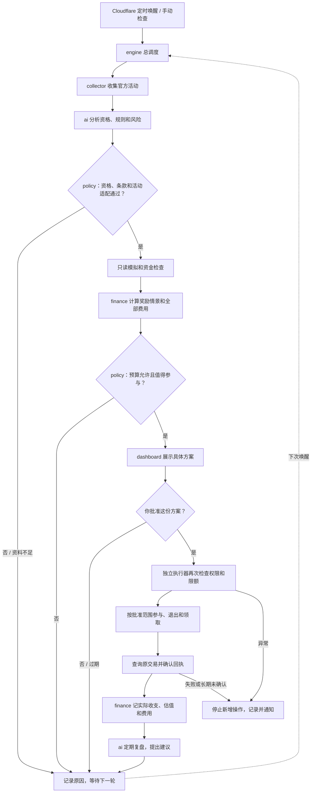

# 架构与边界

这是业务顺序，不表示所有步骤在一次请求内完成。调度器每次推进有限步骤；后续唤醒继续原方案，先查已提交交易。资料不足或不值得参与时不会进入资金操作。

## 模块边界

| 层 | 文件 | 职责与边界 |
|---|---|---|
| 入口和页面 | worker.py、dashboard.py | 接收请求、验证身份、展示和记录用户操作。 |
| 调度 | engine.py | 连接各模块、控制顺序，准备并保存复盘报告。 |
| 业务 | collector.py、ai.py、finance.py、policy.py | 分别负责信息、判断、财务、方案规则；没有私钥。 |
| 基础服务 | storage.py、network.py、config.py、common.py、notifier.py、execution.py | 提供保存、联网、配置、检查、通知、执行器连接。 |
| 钱包执行 | executor/ | 独立服务，重新验权和限额，仅执行获批固定动作。 |

### 为什么这样拆

同一职责放一起：财务模块包含事前测算、事后记账和市场估值；AI 模块包含事前分析和事后复盘。文件合并并不混淆预计收益和真实到账，两类结果仍分开保存。

跨模块通过明确的输入和结果连接：财务模块拿到金额、回执和只读报价能力；规则模块拿到活动、分析和只读模拟能力；AI 复盘拿到准备好的报告。它们不自行寻找钱包，也不互相启动任务。真正安排步骤的是总调度。

依赖方向为入口 → 调度/业务 → 公共支持；没有循环导入。数据库和报价查询由调用方传入；财务计算不依赖 Cloudflare 绑定，便于单独验证。AI 仍通过统一的模型入口预留预算、记录用量，不接触签名权限。

不再额外为每个小函数建文件，也不增加空接口或多层目录。独立执行器保持分开，是因为它掌握钱包签名权限。

Python Worker 每轮只做有界步骤，不使用常驻进程、线程、进程信号、本地 SQLite 或本地暂停文件。D1 lease 防重叠；模型调用前原子预留费用，失败或超时保留预留，不假定免费，不自动重发同一次分析。

批准摘要绑定链、钱包、合约、金额、份额、Gas、次数、有效期与退出条件。主程序没有签名私钥或批准令牌；批准令牌由用户在该次请求中提供并转发，不持久保存。AI 输入不含任何密钥或令牌。外部网页是资料，不能指定执行 calldata。

签名 Worker 默认没有公网路由。Durable Object 串行处理请求。签名交易原文和 hash 先存盘再广播；恢复只查相同 hash，最多重复广播相同字节，不创建新 nonce。回执达到确认数并核对区块 hash 后才推进；失败交易计 Gas 并停止。

适配器只允许精确 ERC20 授权、ERC4626 mint/赎回和 Merkl 领取。mint 固定份额，授权限制最大资产支出，之后撤销余下授权。领取地址固定为实验钱包，callback data 为空。不允许无限授权、借款、任意调用或向其他地址转钱。

## 必须了解的限制

- ERC4626 redeem 没有最小收款参数，模拟不锁定最终退出价格；止损只是尝试退出的触发条件，不是最大亏损保证。
- 目前只支持 Ethereum/BNB Chain 的普通 Gas，未支持有额外 L1 数据费的链。
- 合约字节码 hash 不能识别所有代理实现/治理参数变化，每个真实金库仍要独立审查。
- 最多一个未完成方案、7 笔交易、2 次领取；本金和奖励同币，没有通用卖币/跨链。领取窗口结束可能仍有后续奖励，不能凭结束状态将其算成已到账。
- 暂停阻止新签名，但已广播交易仍会被确认。失败交易、未确认交易、残余授权需要核对后恢复。
- 云端热钱包存在密钥泄露风险。这里是服务和程序限制，不是链上智能钱包的强制权限。只使用独立小额钱包。
- 复盘只提出建议，不能自动扩大金额、修改白名单或部署代码。

账目区分实际代币数量、原生币 Gas、模型用量费用、托管预算和风险预留。`valuation` 用核对时现货价估值，不是实际换币成交价。缺少价格不猜净收益。全部已关闭仓位可给出扣除费用估值和运行预算的 USDT 净收益估算；美元最终账单未核对前 `net_usd_micro` 为 null。

官方依据：
- [Cloudflare Python 入口](https://developers.cloudflare.com/workers/languages/python/basics/)
- [定时事件](https://developers.cloudflare.com/workers/examples/cron-trigger/)
- [D1 Python 绑定](https://developers.cloudflare.com/d1/examples/query-d1-from-python-workers/)
- [ERC4626 标准](https://eips.ethereum.org/EIPS/eip-4626)
- [Merkl 活动接口](https://developers.merkl.xyz/integrate-merkl/opportunities)
- [Merkl 领取](https://developers.merkl.xyz/integrate-merkl/user-rewards)
- [Binance 支持接口边界](https://developers.binance.com/en/docs/introduction)
- [Binance 公共行情接口](https://developers.binance.com/en/docs/products/spot/rest-api)
- [Astra API 规格](https://developers.openai.com/api/docs/models/gpt-6-astra)
